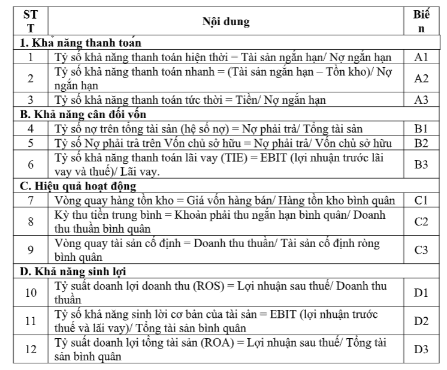

A. Tên ứng dụng:
Hệ thống dự báo khả năng tài chính doanh nghiệp.
Đánh giá điểm tài chính của một donh nghiệp dựa vào các biến:
- Khả năng thanh toán
- Khả năng cân đối vốn
- Hiệu quả hoạt động
- Khả năng sinh lợi

B. Bối cảnh
-	Tên ngành đào tạo: Khoa học máy tính
-	Tên môn học (tiếng Việt): Mô hình tri thức quan hệ và Ứng dụng
-	Tên môn học (tiếng Anh): Relational knowledge model and Applications
-	Mã số môn học: 
-	Bộ môn/giảng viên phụ trách giảng dạy: TS. Nguyễn Đình Hiển PGS.TS. Đỗ Văn Nhơn
-	Thuộc khối kiến thức/ kỹ năng:
-	Số tín chỉ: 03
+ Lý thuyết: 
+ Thực hành:
+ Thí nghiệm hoặc thảo luận:
Video ontology (TS. Nguyễn Đình Hiển): https://www.youtube.com/watch?v=5UfGcmdl-dA

C. Hướng dẫn
Bước 1: tạo env

Bước 2: pip install -r requirements.txt

Bước 3: python mainfrom.py

Bước 4: Add file (VNM, FPT, MWG) từ folder /data

Bước 5: Update file input: sử dụng link sau: https://s.cafef.vn/bao-cao-tai-chinh/vnm/incsta/2024/1/0/0/ket-qua-hoat-dong-kinh-doanh-cong-ty-co-phan-sua-viet-nam.chn

